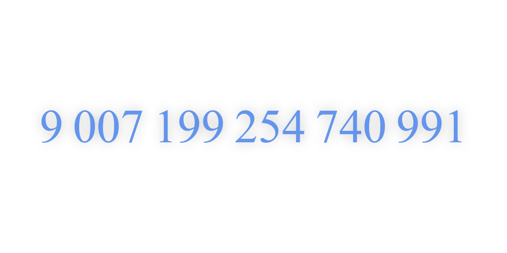
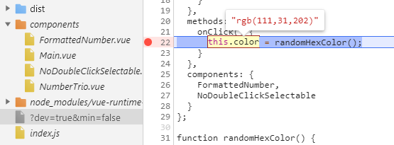
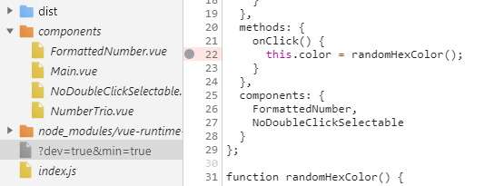

It's the demo site. 

It just shows JavaScript's `MAX_SAFE_INTEGER` value. 
9007199254740991.
With formatting. At the center.

And it changes the color by the click. 

That's all.

[Here's the link](https://alttiri.github.io/demo-max-safe-integer/)

---

You can also load the developer version of Vue.js by specifying the search parameters of the URL.
(It allows you to debug the site with [Vue.js devtools](https://chrome.google.com/webstore/detail/vuejs-devtools/nhdogjmejiglipccpnnnanhbledajbpd).)

[?dev=true](https://alttiri.github.io/demo-max-safe-integer/?dev=true)

Load the minified (with Terser) application code:

[?min=true](https://alttiri.github.io/demo-max-safe-integer/?min=true)

Or both:

[?dev=true&min=true](https://alttiri.github.io/demo-max-safe-integer/?dev=true&min=true)

But the minified version has not working Source Maps. Is it bug of Terser? (I have used [the disabled `compress` option](https://github.com/terser/terser#source-maps-and-debugging) and even `mangle` one too.)
You can see the original, not transpiled, files, but you can't debug them with break points.
The break point is gray, not red (in Chromium 84 based browser).

The not-minified version has no such bug. (Source Maps are generated with Rollup.)

Before Terser:

After Terser:

Firefox behaves the similar way. I can't set break points for the _minified_ version at all.
